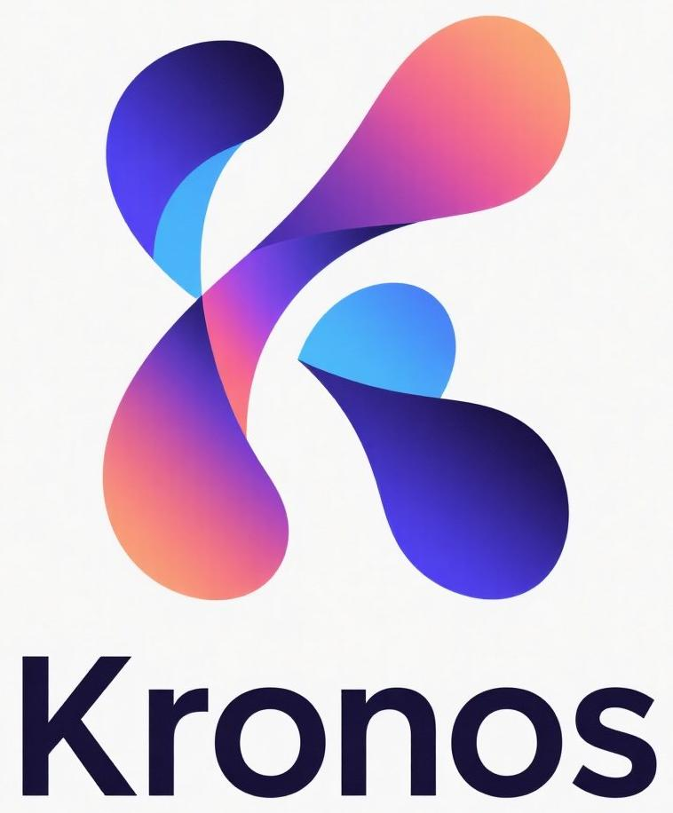
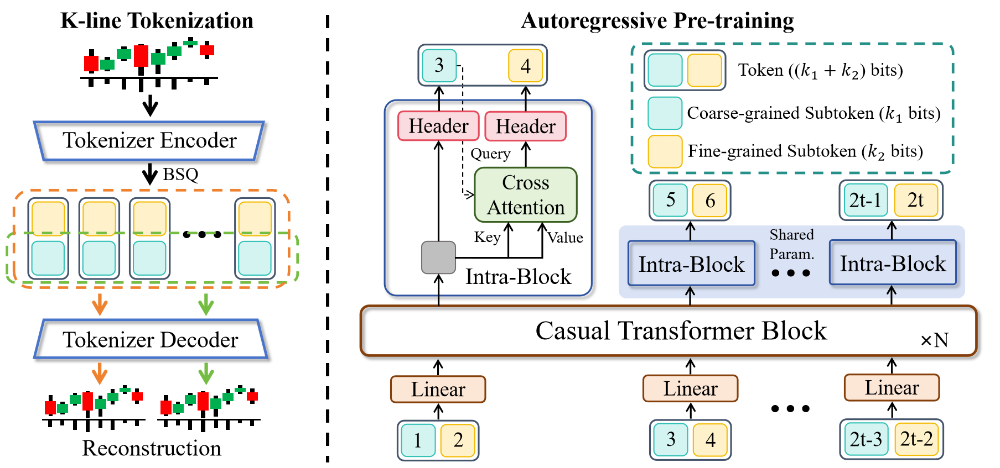
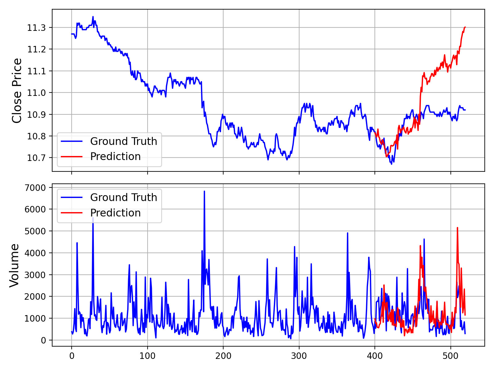

<div align="center">
  <h2><b>Kronos: A Foundation Model for the Language of Financial Markets </b></h2>
</div>


<div align="center">

</a> 
<a href="https://huggingface.co/NeoQuasar"> 
 
</a> 
<a href="https://github.com/shiyu-coder/Kronos/graphs/commit-activity"> 
 
</a> 
<a href="https://github.com/shiyu-coder/Kronos/stargazers"> 
 
</a> 
<a href="https://github.com/shiyu-coder/Kronos/network/members"> 
 
</a> 
<a href="./LICENSE"> 
 
</a>

</div>


<p align="center">



</p>

> Kronos is the **first open-source foundation model** for financial candlesticks (K-lines), 
> trained on data from over **40 global exchanges**.


## 📜 Introduction

**Kronos** is a family of decoder-only foundation models, pre-trained specifically for the "language" of financial markets—K-line sequences. Unlike general-purpose TSFMs, Kronos is designed to handle the unique, high-noise characteristics of financial data. It leverages a novel two-stage framework: 
1. A specialized tokenizer first quantizes continuous, multi-dimensional K-line data (OHLCV) into **hierarchical discrete tokens**. 
2. A large, autoregressive Transformer is then pre-trained on these tokens, enabling it to serve as a unified model for diverse quantitative tasks.

<p align="center">
    
</p>

## 📦 Model Zoo 
We release a family of pre-trained models with varying capacities to suit different computational and application needs. All models are readily accessible from the Hugging Face Hub.

| Model        | Tokenizer                                                                       | Context length | Param  | Open-source                                                               |
|--------------|---------------------------------------------------------------------------------| -------------- | ------ |---------------------------------------------------------------------------|
| Kronos-mini  | Kronos-Tokenizer-2k                                                             | 2048           | 4.1M   | ✅                                                                         |
| Kronos-small | [Kronos-Tokenizer-base](https://huggingface.co/NeoQuasar/Kronos-Tokenizer-base) | 512            | 24.7M  | ✅ [NeoQuasar/Kronos-small](https://huggingface.co/NeoQuasar/Kronos-small) |
| Kronos-base  | [Kronos-Tokenizer-base](https://huggingface.co/NeoQuasar/Kronos-Tokenizer-base) | 512            | 102.3M | ✅ [NeoQuasar/Kronos-base](https://huggingface.co/NeoQuasar/Kronos-base)   |
| Kronos-large | [Kronos-Tokenizer-base](https://huggingface.co/NeoQuasar/Kronos-Tokenizer-base) | 512            | 499.2M | ❌                                                                         |


## 🚀 Getting Started

### Installation

1. Install Python 3.10+, and then install the dependencies:

```shell
pip install -r requirements.txt
```

### 📈 Making Forecasts

Forecasting with Kronos is straightforward using the `KronosPredictor` class. It handles data preprocessing, normalization, prediction, and inverse normalization, allowing you to get from raw data to forecasts in just a few lines of code.

**Important Note**: The `max_context` for `Kronos-small` and `Kronos-base` is **512**. This is the maximum sequence length the model can process. For optimal performance, it is recommended that your input data length (i.e., `lookback`) does not exceed this limit. The `KronosPredictor` will automatically handle truncation for longer contexts.

Here is a step-by-step guide to making your first forecast.

#### 1. Load the Tokenizer and Model

First, load a pre-trained Kronos model and its corresponding tokenizer from the Hugging Face Hub.

```python
from model import Kronos, KronosTokenizer, KronosPredictor

# Load from Hugging Face Hub
tokenizer = KronosTokenizer.from_pretrained("NeoQuasar/Kronos-Tokenizer-base")
model = Kronos.from_pretrained("NeoQuasar/Kronos-small")
```

#### 2. Instantiate the Predictor

Create an instance of `KronosPredictor`, passing the model, tokenizer, and desired device.

```python
# Initialize the predictor
predictor = KronosPredictor(model, tokenizer, device="cuda:0", max_context=512)
```

#### 3. Prepare Input Data

The `predict` method requires three main inputs:
-   `df`: A pandas DataFrame containing the historical K-line data. It must include columns `['open', 'high', 'low', 'close']`. `volume` and `amount` are optional.
-   `x_timestamp`: A pandas Series of timestamps corresponding to the historical data in `df`.
-   `y_timestamp`: A pandas Series of timestamps for the future periods you want to predict.

```python
import pandas as pd

# Load your data
df = pd.read_csv("./data/XSHG_5min_600977.csv")
df['timestamps'] = pd.to_datetime(df['timestamps'])

# Define context window and prediction length
lookback = 400
pred_len = 120

# Prepare inputs for the predictor
x_df = df.loc[:lookback-1, ['open', 'high', 'low', 'close', 'volume', 'amount']]
x_timestamp = df.loc[:lookback-1, 'timestamps']
y_timestamp = df.loc[lookback:lookback+pred_len-1, 'timestamps']
```

#### 4. Generate Forecasts

Call the `predict` method to generate forecasts. You can control the sampling process with parameters like `T`, `top_p`, and `sample_count` for probabilistic forecasting.

```python
# Generate predictions
pred_df = predictor.predict(
    df=x_df,
    x_timestamp=x_timestamp,
    y_timestamp=y_timestamp,
    pred_len=pred_len,
    T=1.0,          # Temperature for sampling
    top_p=0.9,      # Nucleus sampling probability
    sample_count=1  # Number of forecast paths to generate and average
)

print("Forecasted Data Head:")
print(pred_df.head())
```

The `predict` method returns a pandas DataFrame containing the forecasted values for `open`, `high`, `low`, `close`, `volume`, and `amount`, indexed by the `y_timestamp` you provided.

#### 5. Example and Visualization

For a complete, runnable script that includes data loading, prediction, and plotting, please see [`examples/prediction_example.py`](examples/prediction_example.py).

Running this script will generate a plot comparing the ground truth data against the model's forecast, similar to the one shown below:

<p align="center">
    
</p>

## 📖 Citation

If you use Kronos in your research, we would appreciate a citation to our work. The research paper is currently in preparation.

**Paper coming soon!**

## 📜 License 
This project is licensed under the [MIT License](./LICENSE).


